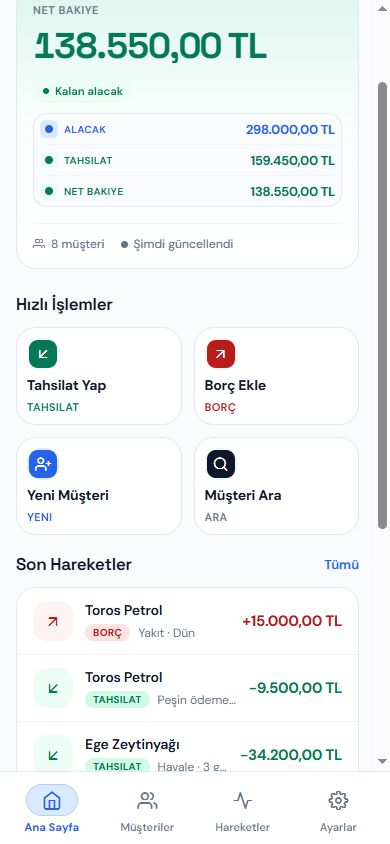
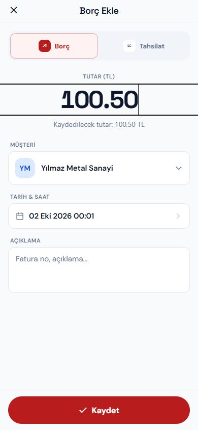

# Yayın öncesi düzenlemeler — 2 Ekim 2026

1 Ekim incelemesindeki kod ve tasarım bulguları giderildi. Canlı yayın yapılmadı. Aşağıdaki kurulum ve gerçek cihaz kontrolleri tamamlanınca yayın kararı verilmeli.

## Yapılanlar

- Para girişi: `100.50` ve `100,50` artık 100,50 TL; `1.234,56` destekleniyor. Belirsiz/bozuk, negatif ve sınırı aşan girişler reddediliyor. Form kaydedilecek tutarı gösteriyor.
- Bildirim kutusu hesap ve cihaz bazında ayrıldı. Eski, hesabı bilinmeyen ortak yerel önbellek kaldırılıyor; canlı kutu sunucudan tekrar yükleniyor. Geciken eski hesap cevapları yeni hesaba yazamıyor.
- Silme/okundu işlemleri sıraya alındı; sunucu veya saklama hatasında kayıt kaybolmuyor, kullanıcı hata görüyor. Toplu silme yalnızca görünen 50 kaydı değil, gözlenen son tarih öncesindeki sunucu geçmişini de siliyor; sonradan gelen bildirim korunuyor.
- Hatırlatma sadece zamanı geldiğinde kuyruğa giriyor. Borç/tahsilat oluşturma ile bildirim işi aynı veritabanı transaction'ında kaydediliyor. Bildirim kutusu ve push işleri ayrı işçi hatlarında yürütülüyor.
- Kalıcı outbox, tekrar deneme, sabit mesaj kimliği ve teslim işaretleri eklendi. Yarım teslim tamamlanabiliyor; silinen kutu kaydı yeniden oluşturulmuyor. Silinmiş/okunmuş bildirim için gecikmiş push engelleniyor.
- Expo push ticket ve receipt kontrolü kalıcı hale getirildi. Kabul edilen push, receipt sorgusu kesildi diye tekrar gönderilmiyor. Geçersiz cihaz token'ı kaldırılıyor. Receipt kontrolü yaklaşık 15 dakika sonra yapılıyor; [Expo'nun gönderim belgesi](https://docs.expo.dev/push-notifications/sending-notifications/) esas alındı. Ağ isteği sonrası süreç kesilmesi gibi belirsiz durumlarda dış servis teslimi tam olarak bir kez garanti edilemez.
- Tüm kategorilerde bildirime dokunma, uygulama/oturum hazır olduktan sonra detay açıyor. Hesap/cihaz eşleşmesi ve gecikmiş yönlendirme kontrolü eklendi. Detay okuma hataları yakalanıyor.
- SecureStore yazıları, token yenileme ve çıkış/yeniden eşleme yarışları düzeltildi. Eski oturum cevapları yeni oturumu kapatamıyor veya eski hesabı geri getiremiyor. Aynı push token başka cihaz/hesapta kalmıyor.
- Uzaktan yardım operatör uçları Admin/Support yetkisi, operatör kimliği, istek sahipliği ve cookie POST için aynı origin kontrolü istiyor.
- Veritabanı bağlantı sırrı proje yapılandırmasından Windows User Secrets'a taşındı. Production'da root hesabı ve uzak veritabanına sertifika doğrulamasız bağlantı reddediliyor.
- TypeScript/RN tip hataları ve lint bulguları düzeltildi. npm standartlaştırıldı; bağımlılık açıkları giderildi. `query-string`/decoder uyumu postinstall betiğiyle sağlanıyor ve paketleme sırasında doğrulandı.
- EAS production canlı API moduna sabitlendi. Production kurulumunda HTTPS API ve EAS proje kimliği doğrulanıyor; eksik mod sessizce demo açmıyor.
- Ana ekran tutarları tam genişlikte okunuyor; hızlı işlem kartları küçültüldü. Açık temanın durum renklerinde kontrast artırıldı. Müşteri seçimi aranabilir alt panelde. Web renk/ölçü değişkenleri ortak CSS dosyasına alındı.

## Doğrulama

| Kontrol | Sonuç |
| --- | --- |
| Web Release build | 0 hata, 0 uyarı |
| NuGet doğrudan/geçişli güvenlik taraması | Bildirilen açık yok |
| Mobil TypeScript ve tüm proje ESLint | 0 hata, 0 uyarı |
| npm audit | 0 açık |
| Expo bağımlılık uyumu | Güncel/uyumlu |
| iOS ve Android Expo export | Başarılı; `release-validation-export` |
| Mobil bildirim/tap/oturum/para/silme testleri | Başarılı |
| Hatırlatma zaman sınırı, UTC ve kayıt sırasında teslim etmeme testleri | Başarılı |
| HTTP operatör yetki ve rol testleri | Başarılı |
| Ayrı geçici MySQL şemasında rollback, lease, tekrar teslim, push receipt ve toplu silme | Başarılı |

MySQL testleri uygulama veritabanına veri yazmadan, yalnızca oluşturulan geçici şemada çalıştı. Mobil tasarım mock verilerle 320 ve 390 piksel genişlikte açık/koyu tema üzerinden incelendi. Web tasarımı kaynak ve Razor derlemesiyle kontrol edildi; çalışan web ekranlarında görsel kabul testi yapılmadı.

## Yayından önce gereken kurulum

1. Sunucuda `ConnectionStrings__DefaultConnection` için root olmayan uygulama kullanıcısı ayarlayın. Uzak MySQL bağlantısı `SslMode=VerifyFull` ve geçerli sunucu sertifikası gerektirir. Şema hazırlama mevcut yöntemle başlangıçta çalışıyor: yeni `ct_notification_outbox` ve `ct_mobile_notification_deliveries` tabloları için gerekli DDL izinleri olmalı. Önce veritabanı yedeği alın. Eski root parolası bu çalışmada döndürülmedi; sunucudaki kullanıcı/geçiş işlemi yapılmadı. Yerel geliştirme bağlantısı standart User Secrets ile korunuyor.
2. Harici destek operatör programı `/api/uzaktan-yardim/v1/operator/*` çağrılarında `X-NSX-Support-Key` göndermeli. Her operatörün en az 32 karakterlik gizli anahtarı sunucu secret yapılandırmasında `RemoteSupport__Operators__operator1__Key`, adı `RemoteSupport__Operators__operator1__Name` olarak tutulmalı. Anahtar URL'ye veya mobil uygulamaya konulmamalı. Admin web oturumu da kullanılabilir. Harici operatör EXE kaynak kodu bu klasörlerde bulunmadığı için onun header değişikliği yapılamadı; mevcut anonim istemci artık 401 alır.
3. EAS production ortamında `EXPO_PUBLIC_NSX_BASE_URL`, `EXPO_PUBLIC_EAS_PROJECT_ID` ve gerekli APNs/FCM kimlik bilgilerini doğrulayın. Normal kurulum `npm ci`; postinstall betikleri atlanmamalı. Backend ve mobil birlikte güncellenmeli; yeni toplu silme tarih sınırı eski backend'de desteklenmez.
4. iPhone development/TestFlight ve Android development/release build üzerinde uygulama açık, arka planda ve tamamen kapalıyken borç/tahsilat/hatırlatma → ekran bildirimi → detay; hesap değişimi, çıkış, silme, bağlantı kesilmesi ve yeniden açma senaryolarını çalıştırın. Expo export native IPA/APK oluşturma ve gerçek cihaz kabul testi yerine geçmez. Bu oturumda bu cihaz testleri yapılmadı.

Testler: `frontend/scripts/test-notifications.cjs`, `frontend/scripts/test-release.cjs`, `tests/ReminderTiming`, `tests/ReleaseSafety` (`--mysql` yalnızca yerel izole şema oluşturur).
